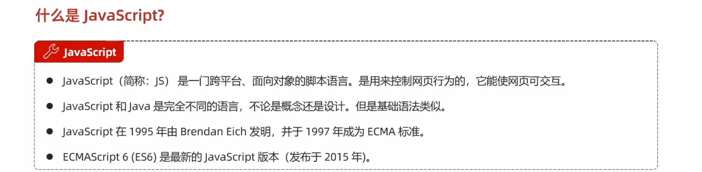

# Day2
## 1.什么是JavaScript

## 2.js引入方式

## 3.JS基础语法
#### 一，书写语法

#### 二，输出语句

#### 三，变量

##### var 定义变量
- 特点1：属于全局变量
- 特点2：可以重复定义
~~~~

        {
        var a=10;
        a="张三";
        a="李四";
        alert(a);
         //var 定义变量
        //特点1：属于全局变量
        //特点2：可以重复定义
        
        }

~~~~
##### 注意事项

~~~~

        {
            let x=1;
            //let x=2; 不可重复定义报错
        }
       // alert(x);x为局部变量，无法弹出

       {
        const pi=3.14;
        //pi=3.15;const为常量 无法改变
        alert(pi);
       }

~~~~

