# Day3
## 一.Js对象
#### 1.Array数组
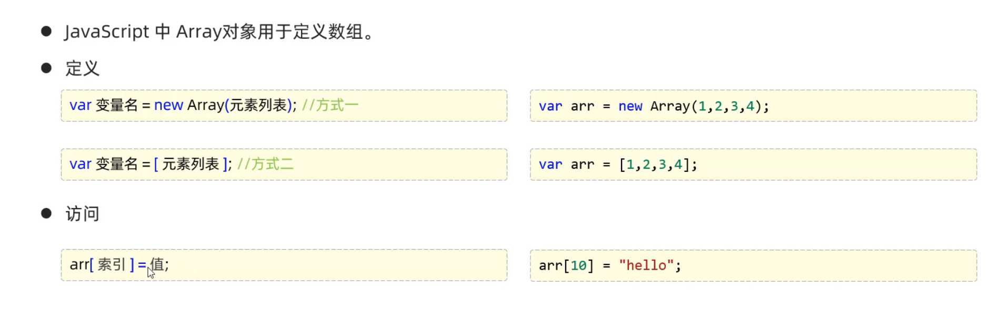
##### **注意事项**
- 定义数组,使用Array()
- 简化定义，使用[]
- 特点：长度可变，类型可变
~~~~
       //长度可变
       arr[10]=50;
       alert(arr[10]);//50
       alert(arr[9]);//undefined
      //类型可变
       arr[8]="hello";
       arr[7]=true;
       alert(arr[8]);//hello
       alert(arr[7]);//true
~~~~
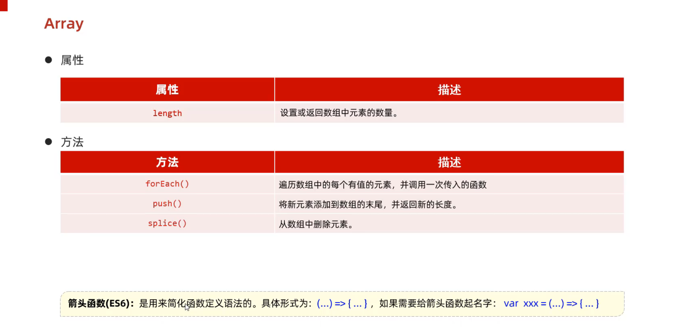
~~~~
        console.log(arr.length);
        //获取数组长度
~~~~
        arr.forEach(function(e){
            console.log(e);
        });
        //遍历数组中有值的元素
~~~~     
        //箭头函数
        arr.forEach((e) => {
            console.log(e);
        });
~~~~     
        arr.push(5);
        //将新元素插入末尾，并返回数组新长度
~~~~
        arr.splice(2,2);//从索引位置2开始删除，删除2个
~~~~
#### 2.String字符串
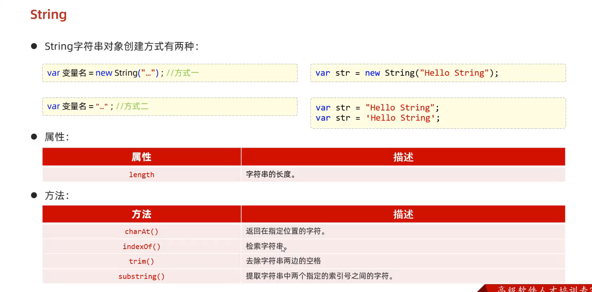
~~~~
        //String的两种创建方式
        var str1=new String("   Hello   ");
        var str2="World";
        console.log(str1);
        console.log(str2);
~~~~
        console.log(str1.length);//获取字符串长度
~~~~
        console.log(str2.charAt(2));//获取指定位置的字符
~~~~

        console.log(str2.indexOf("ld"));//检索ld的位置
~~~~

        console.log(str1.trim());//去除字符 **两边**的空格
~~~~
~~~~
        console.log(str2.substring(3,5));//获取索引在3到5之间的字符**包前不包后**
~~~~
#### 3.自定义对象
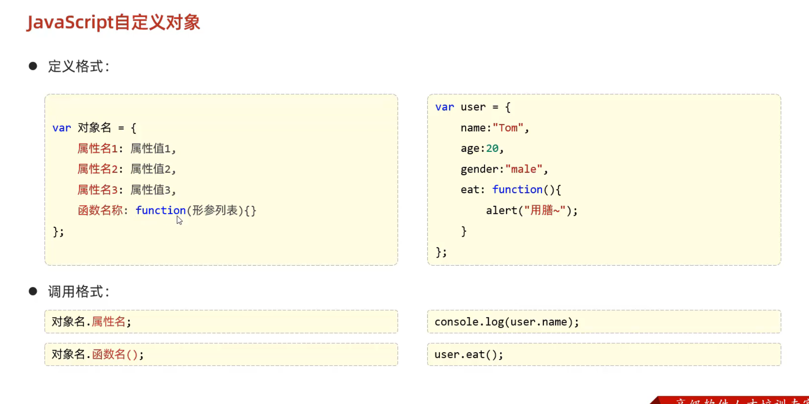
##### **注意事项**
- **自定义对象中的函数方法可简化定义**
~~~~
        var user={
            name:"tom",
            age:10,
            gender:"male",
            eat:function(){
             alert("用膳~");
            }
        }

        //可简化为
         var user={
            name:"tom",
            age:10,
            gender:"male",
            eat(){
            alert("用膳~");
            }
        }
~~~~
#### 4.JSON
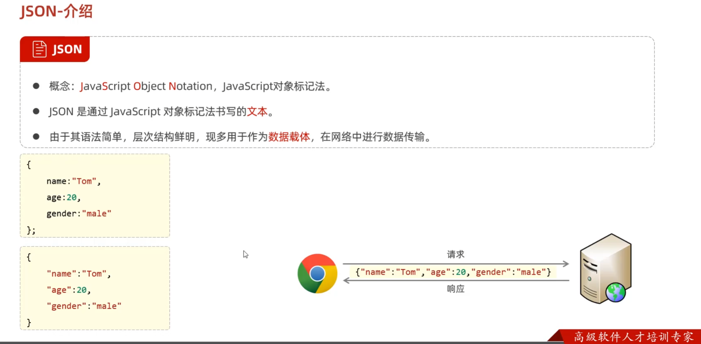
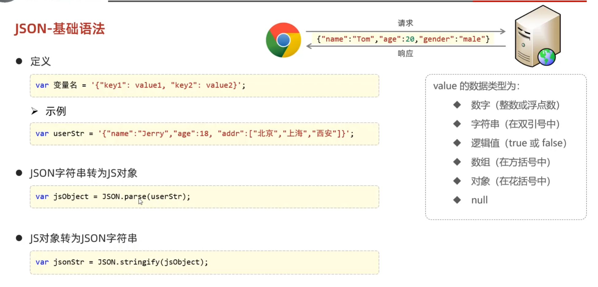
##### **注意事项**
- **JSON字符串最外面为单引号**
- **JSON中的Key都要用双引号标记**
- **JSON格式为字符串，只有转换为JS对象才能引用里面的值**
~~~~
        var jsonstr='{"name":"Tom","age":18,"addr":["北京"," 上海","西安"]}';
        var jsonObject=JSON.parse(jsonstr);
        alert(jsonObject.name);//Tom
        alert(JSON.stringify(jsonObject));
~~~~
#### 5.BOM
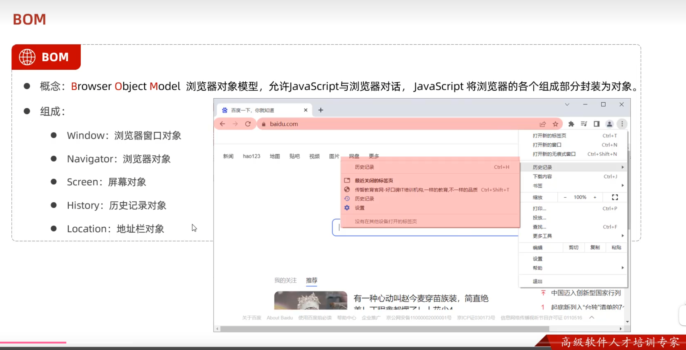
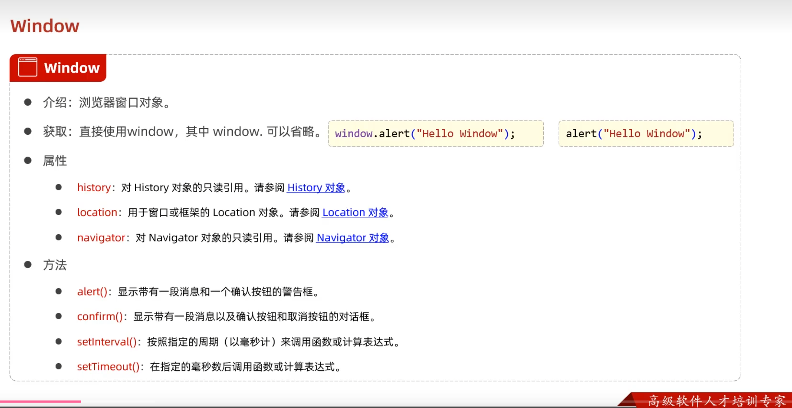
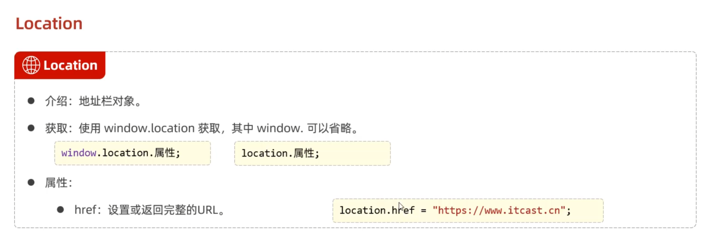
~~~~
        //confrim对话框
        var flag=window.confirm("确认删除该记录吗");
        alert(flag);
        //确定为true,取消为false

        //定时器——setInterval--周期性的执行某一个函数
        var i=0;
        setInterval(function(){
            i++;
            console.log("定时器执行了"+i+"次");   
        },2000)//每两秒执行一次

        //定时器-setTimeout--延迟执行一次
        setTimeout(function(){
            alert("延迟执行了一次");
        },3000)//延迟3秒

        //location
        alert(location.href);//获取浏览器地址
        location.href="https://www.yuanshen.com/";
        //修改浏览器域名后跳转
~~~~
#### 6.DOM
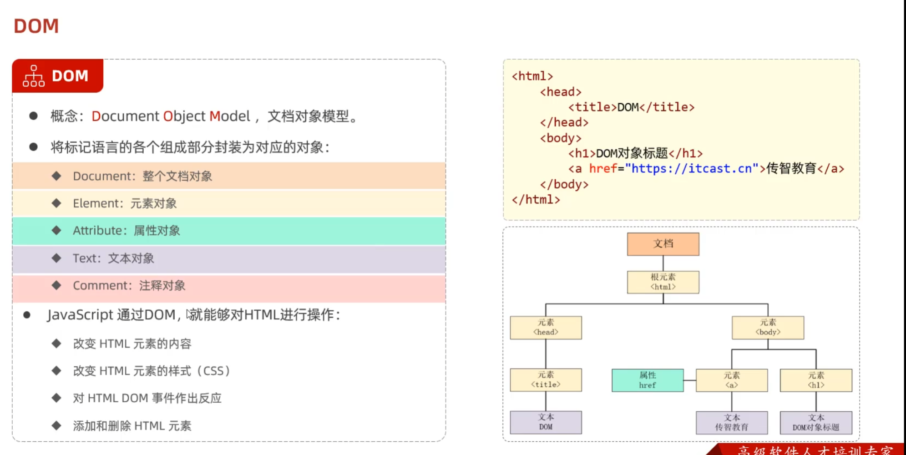
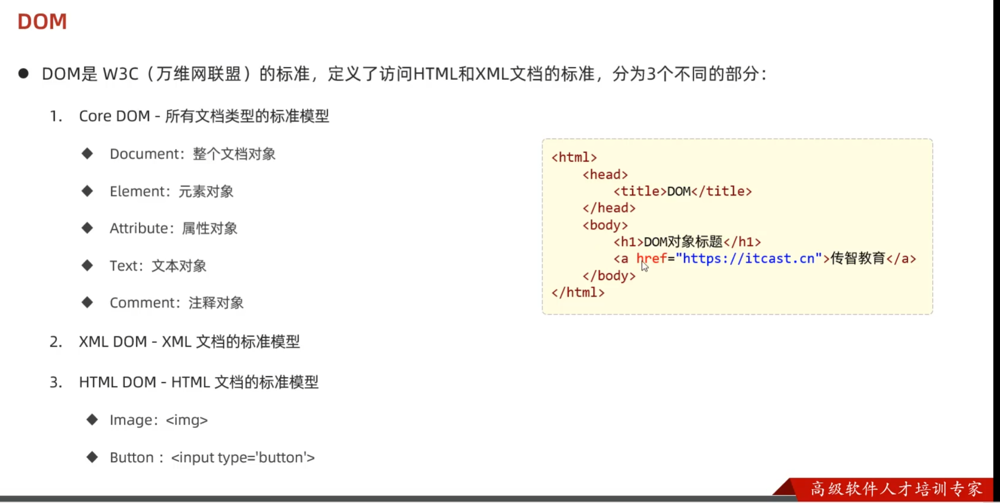
##### **注意事项**
- **1.先获取元素对象**
- **2.再查询手册找需要的方法**

