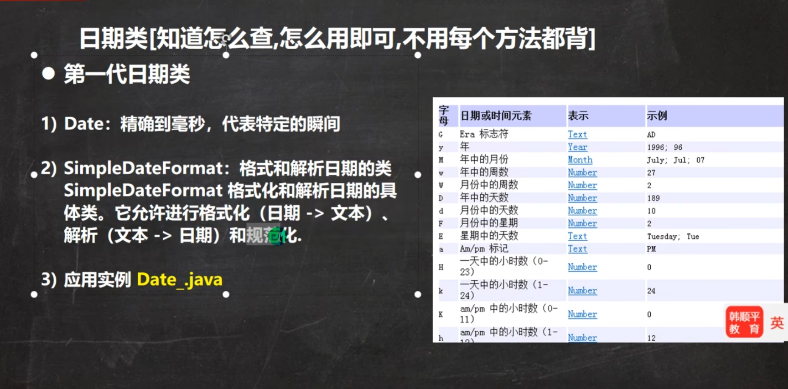
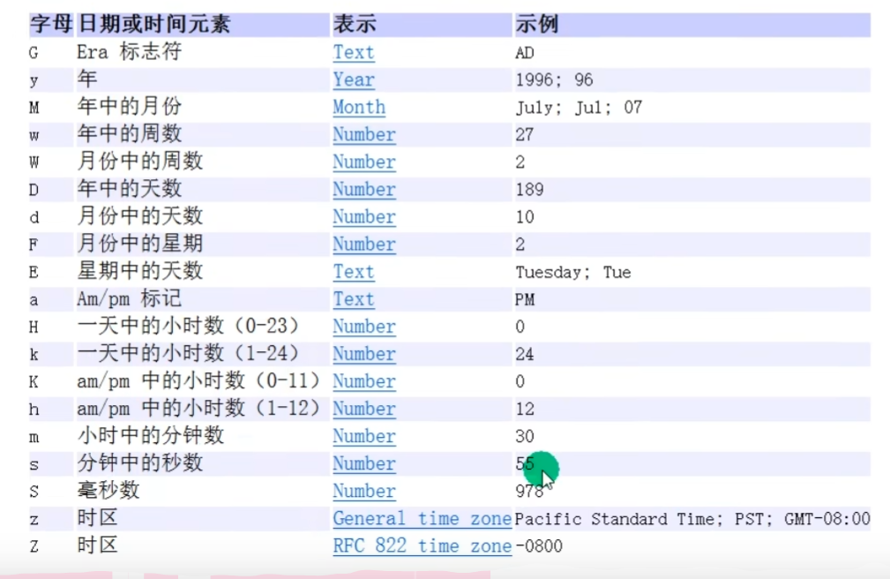
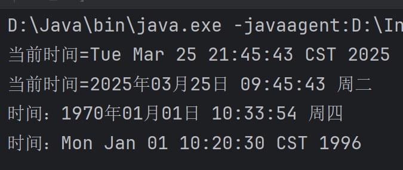
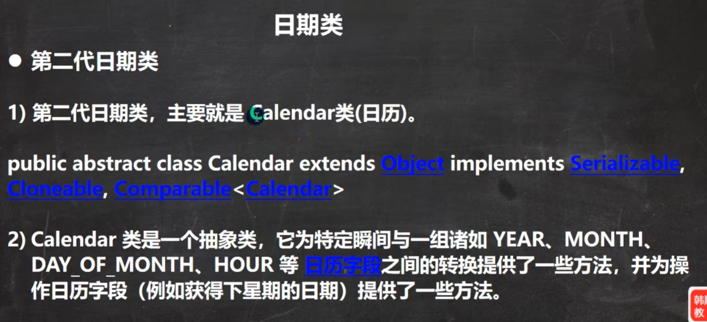

# Day10
## 一，日期类
#### 1.第一代日期类：Date

##### 注意事项
+ **包为 java.util.Date**
+ **默认的格式为外国格式，因此需要格式转换**
**这里的格式使用字母是固定好的，不能乱写**

~~~~
        Date d1=new Date();//获取当前系统时间
        System.out.println("当前时间="+d1);

        SimpleDateFormat sdf=new SimpleDateFormat("yyyy年MM月dd日 hh:mm:ss E");
        String format=sdf.format(d1);//将日期转换为指定格式的字符串
        System.out.println("当前时间="+format);

        Date d2=new Date(9234567);//通过指定毫秒数得到时间
        String format2=sdf.format(d2);
        System.out.println("时间："+format2);//获取某个时间对应的毫秒数

        //把一个格式化的String 转成对应的Date
        //得到的Date为外国形式
        //在把String->Date,使用的sdf格式需要与你给的String的格式一样，否会转换异常
        String s="1996年01月01日 10:20:30 星期一";
        Date parse=sdf.parse(s);
        System.out.println("时间："+parse);
~~~~

##### 注意事项
+ **得到的Date为外国形式**
+ **在把String->Date,使用的sdf格式需要与你给的String的格式一样，否会转换异常**
#### 2.第二代日期类：Calendar

+ **Calendar是一个抽象类，并且构造器是私有的**
+ **可以通过 getInstance() 来获取实例**
+ **提供大量方法和字段**

  