# 计算机网络体系结构
***
## 1.常见的计算机网络体系结构
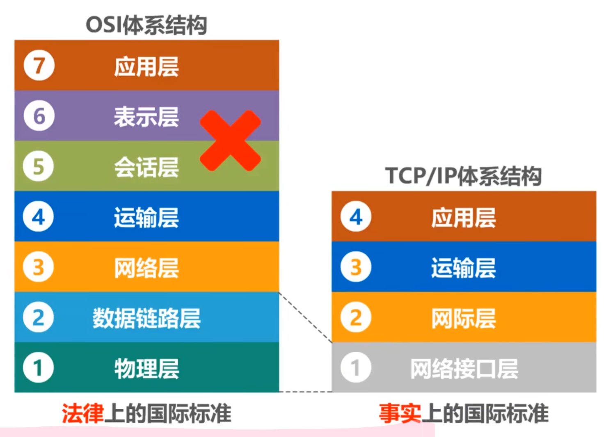
***

***
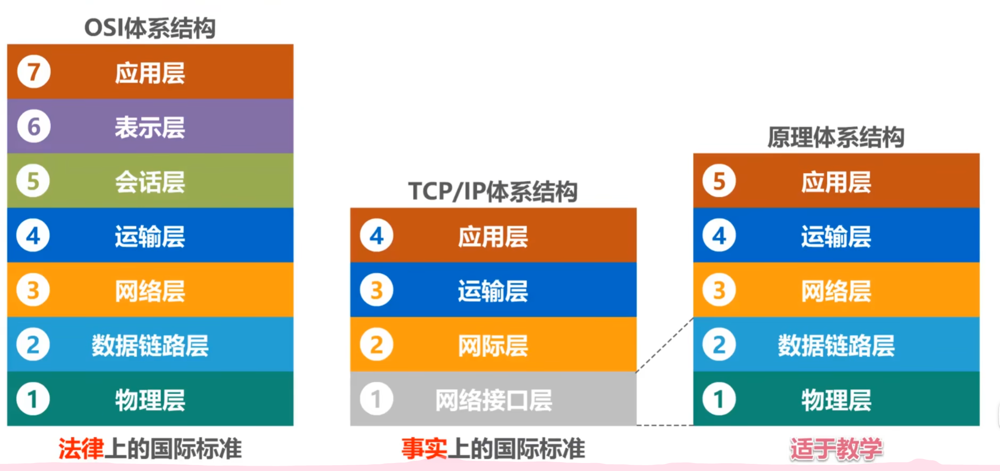
***
## 2.计算机网络体系结构分层的必要性
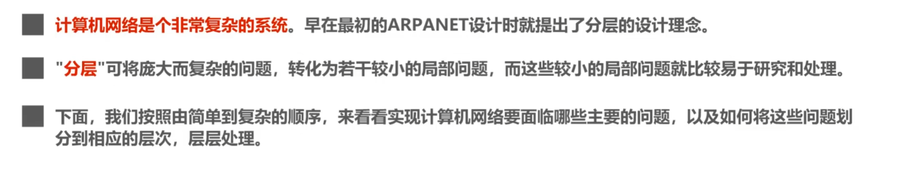
***
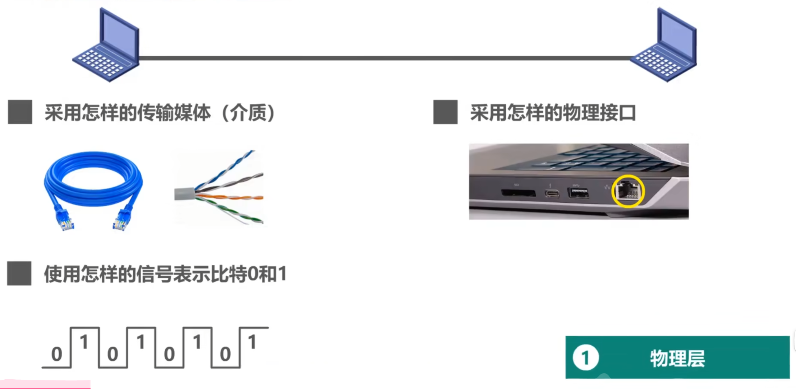
***
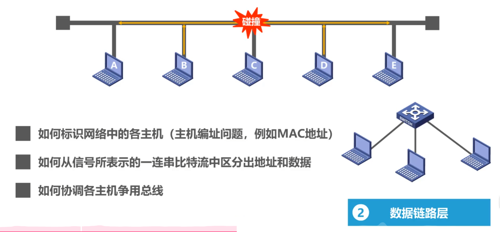
***
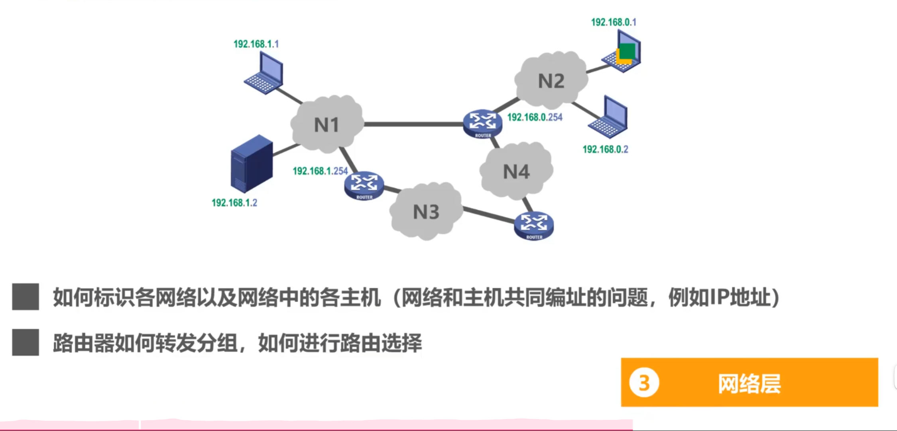
***
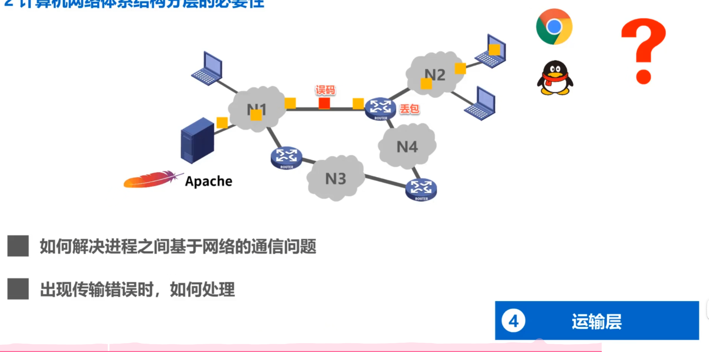
***
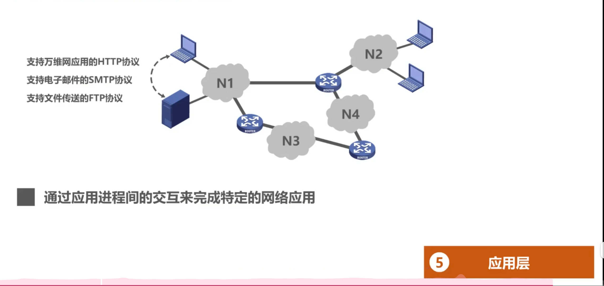
***
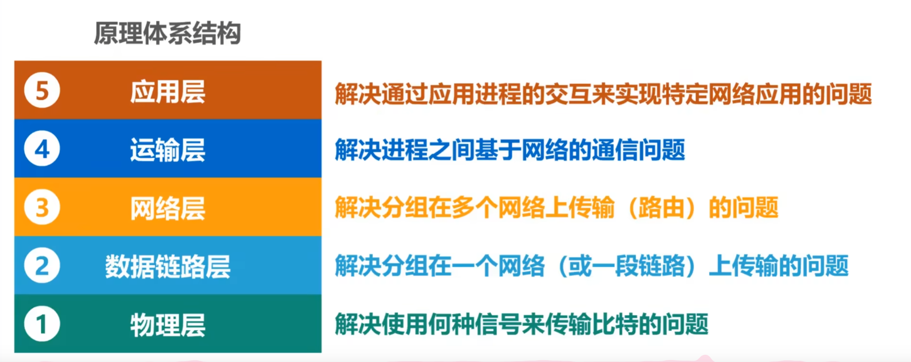
***
## 3.计算机网络体系结构分层思想举例
https://www.bilibili.com/video/BV1c4411d7jb/?spm_id_from=333.1391.0.0&p=9&vd_source=00178b99806066401ab718a73cb65390
***
## 4.计算机网络体系结构中的专用术语
***
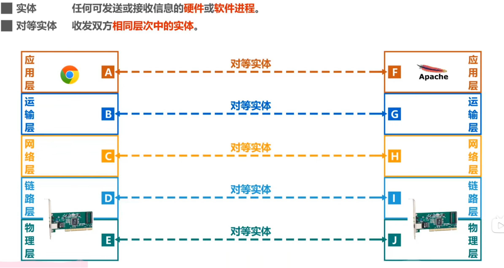
***
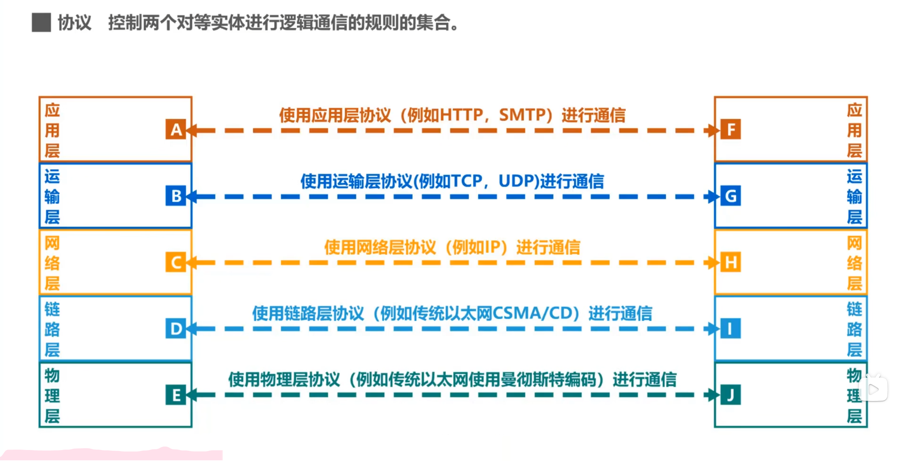
***
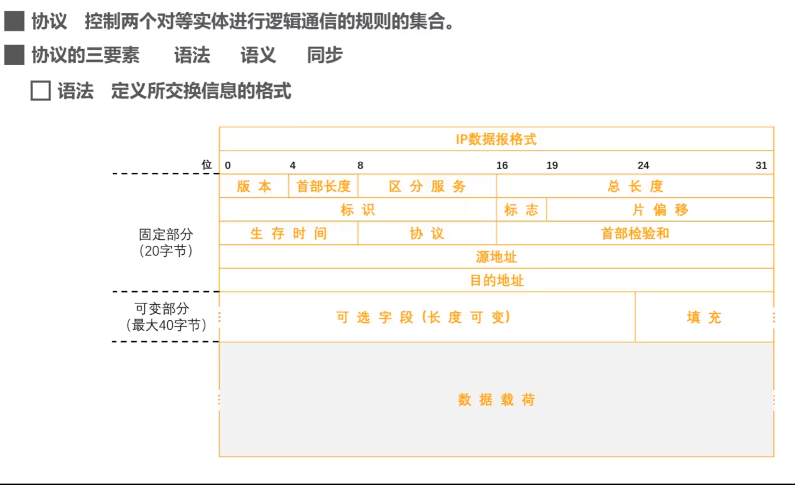
***
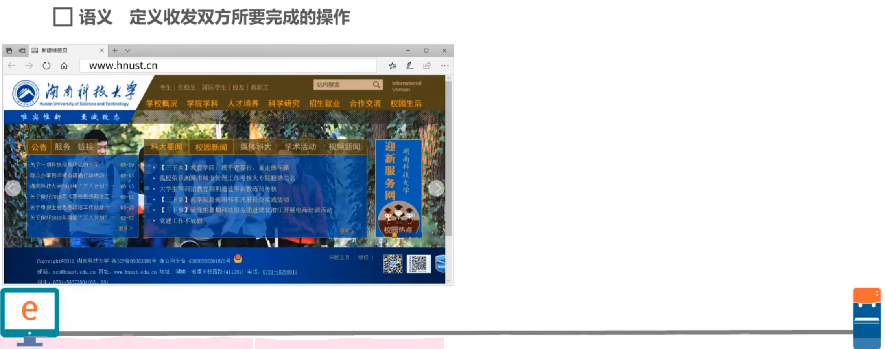
***
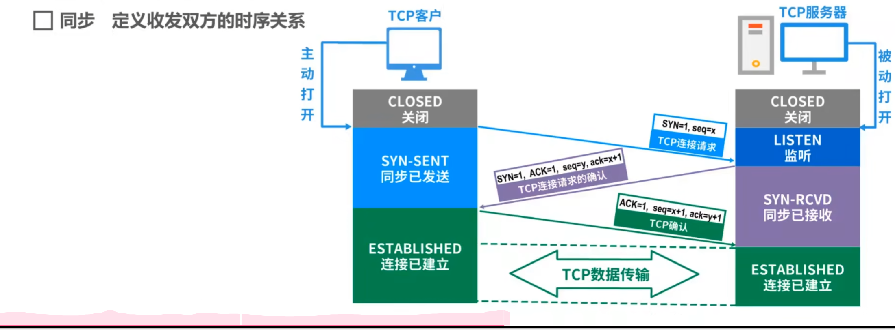
***
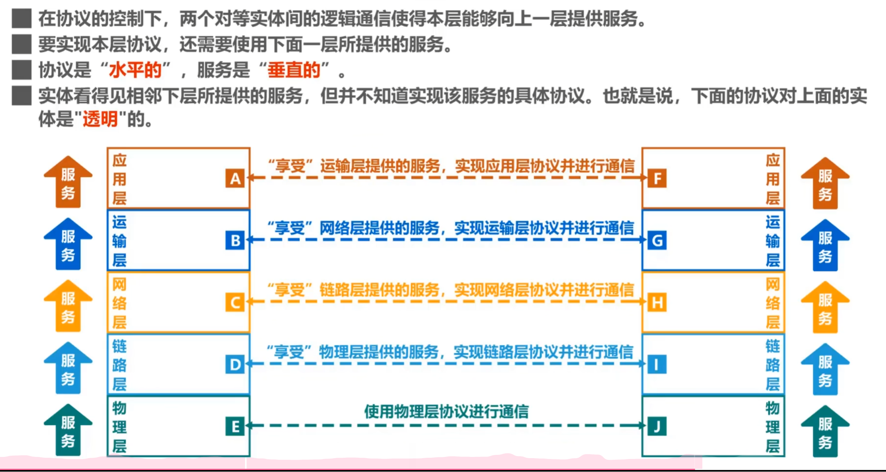
***
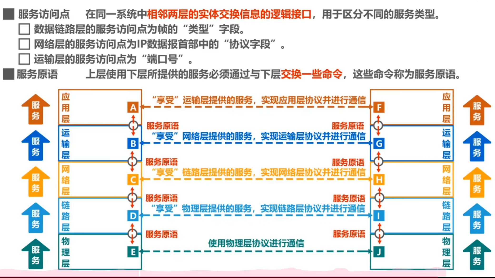
***
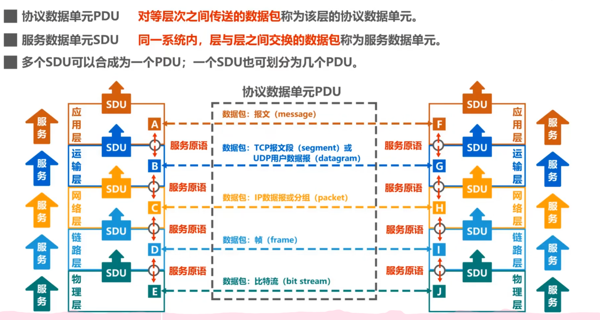
