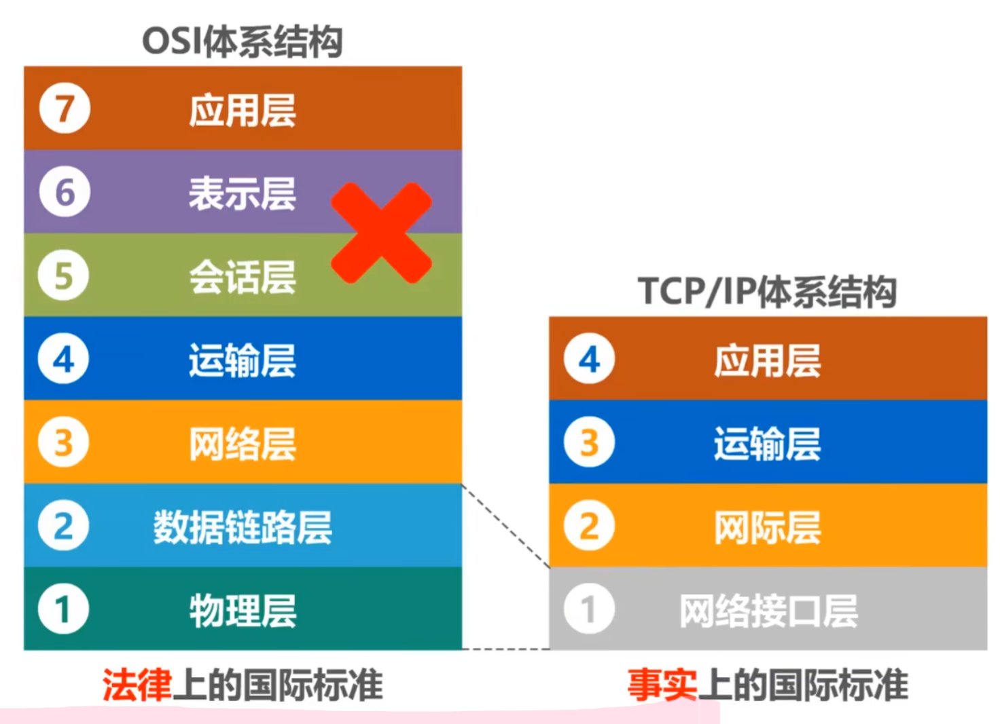
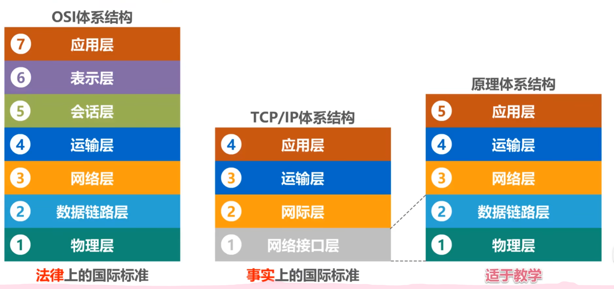
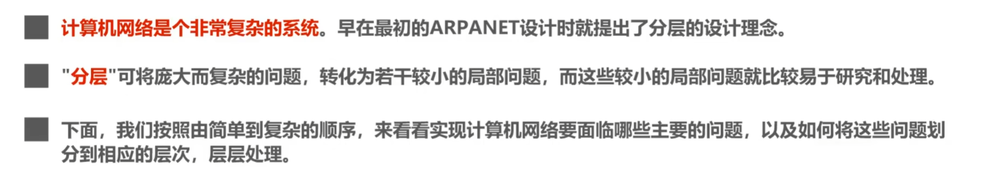
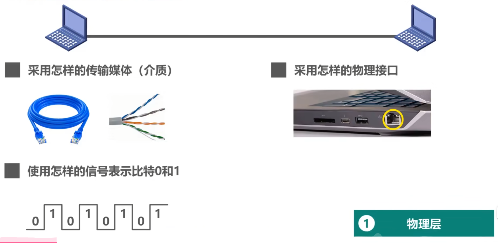
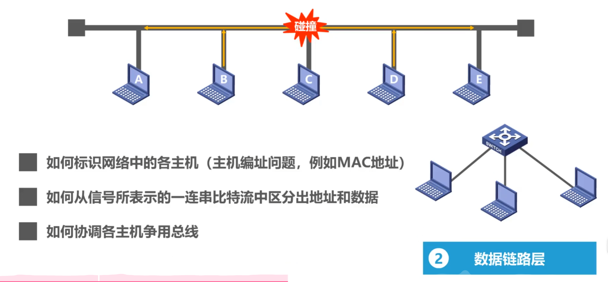
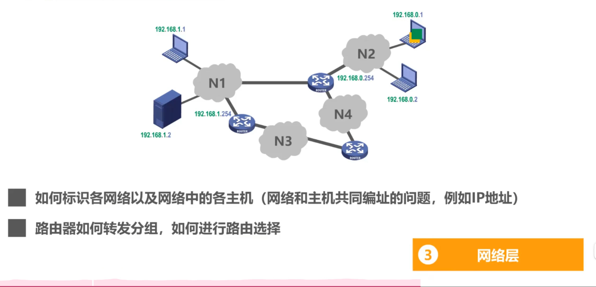
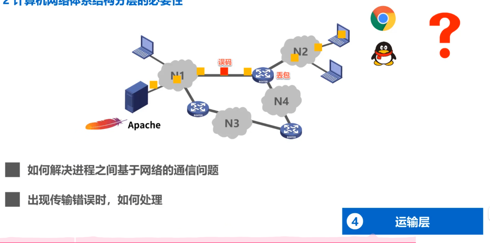
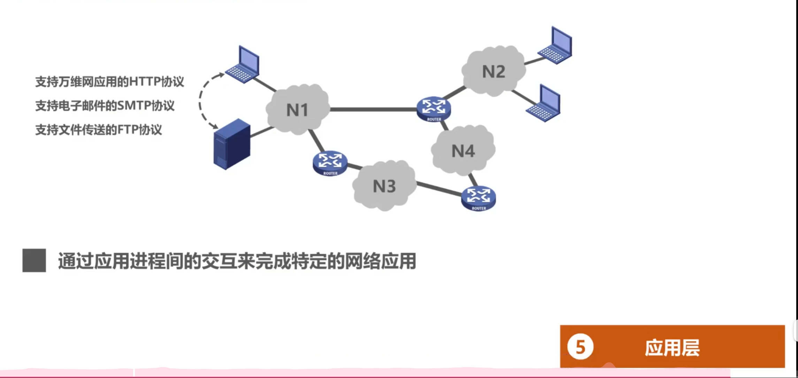
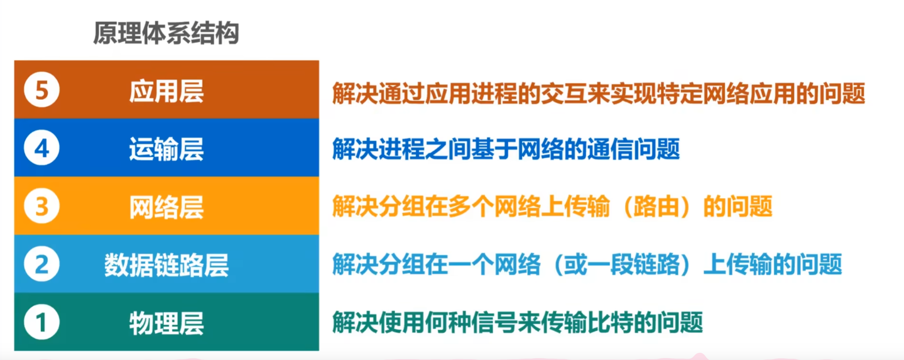

# 计算机网络体系结构
***
## 1.常见的计算机网络体系结构

***

***

***
## 2.计算机网络体系结构分层的必要性

***

***

***

***

***

***

***
## 3.计算机网络体系结构分层思想举例
<video controls src="../图片/5.计算机网络体系结构/屏幕录制 2025-03-27 154705.mp4" title="Title"></video>
***
## 4.计算机网络体系结构中的专用术语
